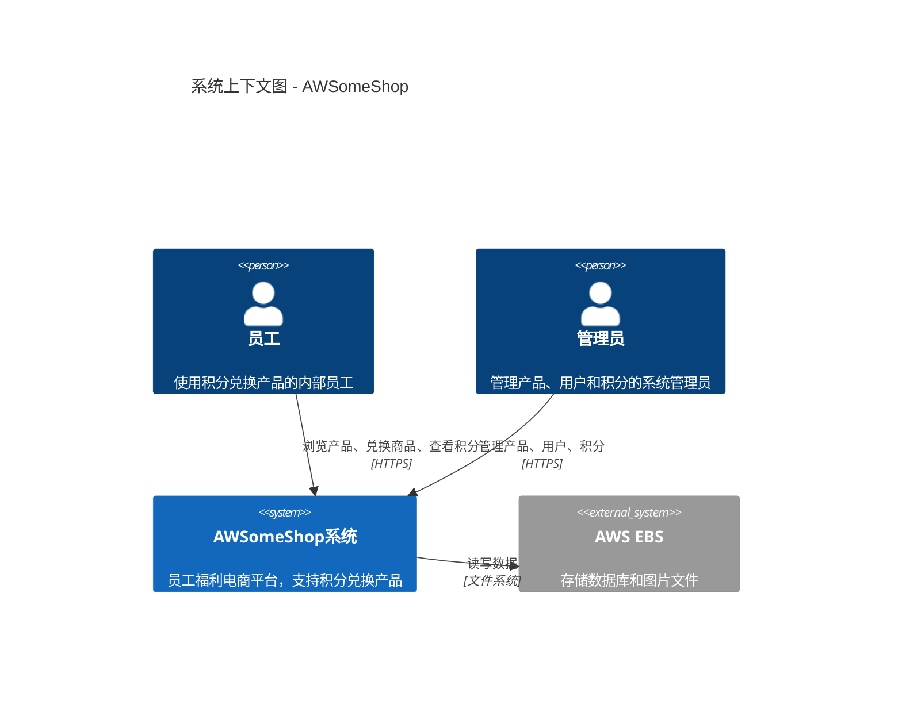
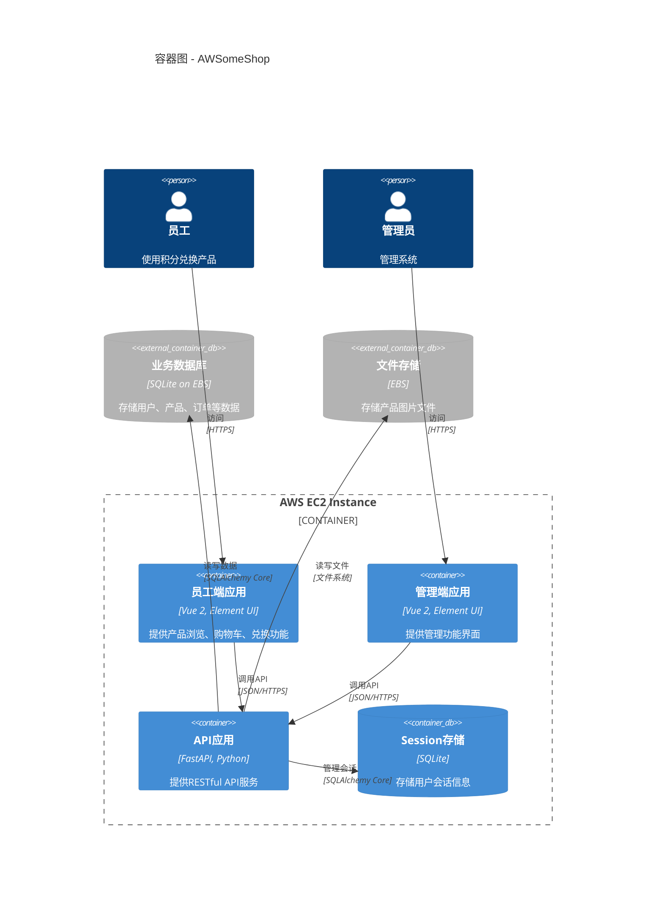
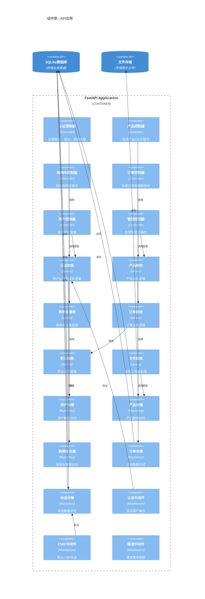

# AWSomeShop 设计文档

## 概述

AWSomeShop 是一个内部员工福利电商网站，允许员工使用 AWSome 积分浏览和兑换产品。本文档描述了系统的技术架构、数据模型、组件设计和接口规范。

### 系统目标

- 支持 100 名员工使用
- 支持最多 50 个并发用户
- 页面加载时间 < 3 秒
- 系统可用性 95%
- 开发周期：2 天

### 技术栈

**前端**
- Vue 2.x
- Element UI
- Vuex 3
- Vue Router
- Webpack
- Axios

**后端**
- Python 3.8+
- FastAPI
- SQLAlchemy Core（非 ORM 模式）
- aiosqlite（异步 SQLite 驱动）
- bcrypt（密码哈希）
- Pillow（图片处理）

**数据库**
- SQLite（文件数据库）

**部署**
- AWS EC2
- AWS EBS（数据库和图片存储）

## 架构设计

### C4 模型架构图

#### Level 1: 系统上下文图（System Context）



#### Level 2: 容器图（Container Diagram）



#### Level 3: 组件图（Component Diagram）



### 整体架构说明

系统采用前后端分离架构，但部署在同一服务器上。前端包含员工端和管理端两个独立应用，后端采用分层架构（Controller-Service-Repository）提供统一的 RESTful API 服务。

### 分层架构

**Controller 层（控制器）**
- 处理 HTTP 请求和响应
- 参数验证
- Session 管理
- 调用 Service 层

**Service 层（业务逻辑）**
- 实现业务逻辑
- 事务管理
- 调用 Repository 层
- 数据转换

**Repository 层（数据访问）**
- 数据库操作
- SQL 查询封装
- 连接池管理

### 前端架构

前端分为两个独立的应用：

**员工端（Personal）**
- 产品浏览和搜索
- 购物车管理
- 积分兑换
- 个人中心
- 兑换历史

**管理端（Manage）**
- 用户管理
- 产品管理
- 分类管理
- 积分管理
- 操作日志查看

两个应用共享：
- 通用组件
- API 请求封装
- 工具函数
- 样式主题

### 项目目录结构

```
AWSomeShop/
├── front/                      # 前端代码
│   ├── personal/               # 员工端
│   │   ├── src/
│   │   │   ├── views/          # 页面组件
│   │   │   ├── components/     # 通用组件
│   │   │   ├── store/          # Vuex 状态管理
│   │   │   ├── router/         # 路由配置
│   │   │   ├── api/            # API 请求
│   │   │   ├── utils/          # 工具函数
│   │   │   └── assets/         # 静态资源
│   │   ├── public/
│   │   └── package.json
│   ├── manage/                 # 管理端
│   │   ├── src/
│   │   │   ├── views/
│   │   │   ├── components/
│   │   │   ├── store/
│   │   │   ├── router/
│   │   │   ├── api/
│   │   │   ├── utils/
│   │   │   └── assets/
│   │   ├── public/
│   │   └── package.json
│   └── static/                 # 构建输出目录
│       ├── personal/
│       └── manage/
├── server/                     # 后端代码
│   ├── controllers/            # 控制器
│   │   ├── auth_controller.py
│   │   ├── product_controller.py
│   │   ├── cart_controller.py
│   │   ├── order_controller.py
│   │   ├── user_controller.py
│   │   └── admin_controller.py
│   ├── services/               # 业务逻辑
│   │   ├── auth_service.py
│   │   ├── product_service.py
│   │   ├── cart_service.py
│   │   ├── order_service.py
│   │   ├── point_service.py
│   │   └── file_service.py
│   ├── repositories/           # 数据访问
│   │   ├── user_repository.py
│   │   ├── product_repository.py
│   │   ├── cart_repository.py
│   │   ├── order_repository.py
│   │   └── session_repository.py
│   ├── models/                 # 数据模型
│   │   └── database.py
│   ├── middleware/             # 中间件
│   │   ├── auth_middleware.py
│   │   ├── csrf_middleware.py
│   │   └── rate_limit_middleware.py
│   ├── utils/                  # 工具函数
│   │   ├── password.py
│   │   ├── image.py
│   │   └── response.py
│   ├── config/                 # 配置文件
│   │   └── settings.py
│   ├── static/                 # 静态文件（图片）
│   │   └── images/
│   ├── logs/                   # 日志文件
│   ├── main.py                 # 应用入口
│   └── init_db.py              # 数据库初始化脚本
├── data/                       # 数据库文件
│   └── awsome_shop.db
├── requirements.txt            # Python 依赖
└── README.md
```

## 数据模型

### 数据库表设计

#### 1. 用户表（users）

| 字段名 | 类型 | 约束 | 说明 |
|--------|------|------|------|
| id | INTEGER | PRIMARY KEY AUTOINCREMENT | 用户ID |
| username | VARCHAR(50) | UNIQUE, NOT NULL | 用户名 |
| password_hash | VARCHAR(255) | NOT NULL | 密码哈希 |
| real_name | VARCHAR(100) | NOT NULL | 真实姓名 |
| employee_id | VARCHAR(50) | UNIQUE, NOT NULL | 工号 |
| department | VARCHAR(100) | NOT NULL | 部门 |
| position | VARCHAR(100) | NULL | 职位 |
| role | VARCHAR(20) | NOT NULL | 角色（employee/admin） |
| points | INTEGER | NOT NULL, DEFAULT 1000 | 积分余额 |
| is_active | BOOLEAN | NOT NULL, DEFAULT TRUE | 账户状态 |
| created_at | DATETIME | NOT NULL | 创建时间 |
| updated_at | DATETIME | NOT NULL | 更新时间 |
| last_login_at | DATETIME | NULL | 最后登录时间 |

**索引**
- `idx_username` ON username
- `idx_employee_id` ON employee_id
- `idx_role` ON role

#### 2. 收货地址表（addresses）

| 字段名 | 类型 | 约束 | 说明 |
|--------|------|------|------|
| id | INTEGER | PRIMARY KEY AUTOINCREMENT | 地址ID |
| user_id | INTEGER | FOREIGN KEY, NOT NULL | 用户ID |
| address | VARCHAR(500) | NOT NULL | 收货地址 |
| phone | VARCHAR(20) | NOT NULL | 联系电话 |
| created_at | DATETIME | NOT NULL | 创建时间 |
| updated_at | DATETIME | NOT NULL | 更新时间 |

**索引**
- `idx_user_id` ON user_id

#### 3. 产品分类表（categories）

| 字段名 | 类型 | 约束 | 说明 |
|--------|------|------|------|
| id | INTEGER | PRIMARY KEY AUTOINCREMENT | 分类ID |
| name | VARCHAR(100) | NOT NULL | 分类名称 |
| parent_id | INTEGER | FOREIGN KEY, NULL | 父分类ID（NULL表示一级分类） |
| sort_order | INTEGER | NOT NULL, DEFAULT 0 | 排序顺序 |
| created_at | DATETIME | NOT NULL | 创建时间 |
| updated_at | DATETIME | NOT NULL | 更新时间 |

**索引**
- `idx_parent_id` ON parent_id

#### 4. 产品表（products）

| 字段名 | 类型 | 约束 | 说明 |
|--------|------|------|------|
| id | INTEGER | PRIMARY KEY AUTOINCREMENT | 产品ID |
| name | VARCHAR(200) | NOT NULL | 产品名称 |
| description | TEXT | NULL | 产品描述 |
| points_required | INTEGER | NOT NULL | 所需积分 |
| status | VARCHAR(20) | NOT NULL | 状态（active/inactive） |
| is_deleted | BOOLEAN | NOT NULL, DEFAULT FALSE | 软删除标记 |
| created_at | DATETIME | NOT NULL | 创建时间 |
| updated_at | DATETIME | NOT NULL | 更新时间 |

**索引**
- `idx_name` ON name
- `idx_status` ON status
- `idx_is_deleted` ON is_deleted
- `idx_points_required` ON points_required

#### 5. 产品图片表（product_images）

| 字段名 | 类型 | 约束 | 说明 |
|--------|------|------|------|
| id | INTEGER | PRIMARY KEY AUTOINCREMENT | 图片ID |
| product_id | INTEGER | FOREIGN KEY, NOT NULL | 产品ID |
| original_filename | VARCHAR(255) | NOT NULL | 原始文件名 |
| stored_filename | VARCHAR(255) | NOT NULL | 存储文件名（UUID） |
| thumbnail_filename | VARCHAR(255) | NOT NULL | 缩略图文件名 |
| file_path | VARCHAR(500) | NOT NULL | 文件路径 |
| file_size | INTEGER | NOT NULL | 文件大小（字节） |
| sort_order | INTEGER | NOT NULL, DEFAULT 0 | 排序顺序 |
| created_at | DATETIME | NOT NULL | 创建时间 |

**索引**
- `idx_product_id` ON product_id

#### 6. 产品分类关联表（product_categories）

| 字段名 | 类型 | 约束 | 说明 |
|--------|------|------|------|
| id | INTEGER | PRIMARY KEY AUTOINCREMENT | 关联ID |
| product_id | INTEGER | FOREIGN KEY, NOT NULL | 产品ID |
| category_id | INTEGER | FOREIGN KEY, NOT NULL | 分类ID |
| created_at | DATETIME | NOT NULL | 创建时间 |

**索引**
- `idx_product_id` ON product_id
- `idx_category_id` ON category_id
- `unique_product_category` UNIQUE(product_id, category_id)

#### 7. 购物车表（carts）

| 字段名 | 类型 | 约束 | 说明 |
|--------|------|------|------|
| id | INTEGER | PRIMARY KEY AUTOINCREMENT | 购物车ID |
| user_id | INTEGER | FOREIGN KEY, NOT NULL | 用户ID |
| product_id | INTEGER | FOREIGN KEY, NOT NULL | 产品ID |
| quantity | INTEGER | NOT NULL, DEFAULT 1 | 数量 |
| created_at | DATETIME | NOT NULL | 添加时间 |
| updated_at | DATETIME | NOT NULL | 更新时间 |

**索引**
- `idx_user_id` ON user_id
- `unique_user_product` UNIQUE(user_id, product_id)

**约束**
- quantity > 0
- 每个用户购物车总商品数量 ≤ 100

#### 8. 订单表（orders）

| 字段名 | 类型 | 约束 | 说明 |
|--------|------|------|------|
| id | INTEGER | PRIMARY KEY AUTOINCREMENT | 订单ID |
| order_no | VARCHAR(50) | UNIQUE, NOT NULL | 订单号 |
| user_id | INTEGER | FOREIGN KEY, NOT NULL | 用户ID |
| total_points | INTEGER | NOT NULL | 总消耗积分 |
| status | VARCHAR(20) | NOT NULL | 订单状态（completed） |
| shipping_address | VARCHAR(500) | NOT NULL | 收货地址快照 |
| shipping_phone | VARCHAR(20) | NOT NULL | 联系电话快照 |
| created_at | DATETIME | NOT NULL | 创建时间 |

**索引**
- `idx_order_no` ON order_no
- `idx_user_id` ON user_id
- `idx_created_at` ON created_at

#### 9. 订单明细表（order_items）

| 字段名 | 类型 | 约束 | 说明 |
|--------|------|------|------|
| id | INTEGER | PRIMARY KEY AUTOINCREMENT | 明细ID |
| order_id | INTEGER | FOREIGN KEY, NOT NULL | 订单ID |
| product_id | INTEGER | FOREIGN KEY, NOT NULL | 产品ID |
| product_name | VARCHAR(200) | NOT NULL | 产品名称快照 |
| quantity | INTEGER | NOT NULL | 数量 |
| points_per_item | INTEGER | NOT NULL | 单价积分 |
| subtotal_points | INTEGER | NOT NULL | 小计积分 |
| created_at | DATETIME | NOT NULL | 创建时间 |

**索引**
- `idx_order_id` ON order_id
- `idx_product_id` ON product_id

#### 10. 积分交易表（point_transactions）

| 字段名 | 类型 | 约束 | 说明 |
|--------|------|------|------|
| id | INTEGER | PRIMARY KEY AUTOINCREMENT | 交易ID |
| user_id | INTEGER | FOREIGN KEY, NOT NULL | 用户ID |
| transaction_type | VARCHAR(20) | NOT NULL | 交易类型（grant/consume） |
| amount | INTEGER | NOT NULL | 积分数量 |
| balance_after | INTEGER | NOT NULL | 交易后余额 |
| order_id | INTEGER | FOREIGN KEY, NULL | 关联订单ID（消费时） |
| admin_id | INTEGER | FOREIGN KEY, NULL | 操作管理员ID（发放时） |
| description | VARCHAR(500) | NULL | 描述 |
| created_at | DATETIME | NOT NULL | 创建时间 |

**索引**
- `idx_user_id` ON user_id
- `idx_transaction_type` ON transaction_type
- `idx_created_at` ON created_at

#### 11. Session 表（sessions）

| 字段名 | 类型 | 约束 | 说明 |
|--------|------|------|------|
| id | INTEGER | PRIMARY KEY AUTOINCREMENT | Session ID |
| session_id | VARCHAR(255) | UNIQUE, NOT NULL | Session 标识 |
| user_id | INTEGER | FOREIGN KEY, NOT NULL | 用户ID |
| data | TEXT | NULL | Session 数据（JSON） |
| created_at | DATETIME | NOT NULL | 创建时间 |
| expires_at | DATETIME | NOT NULL | 过期时间 |

**索引**
- `idx_session_id` ON session_id
- `idx_user_id` ON user_id
- `idx_expires_at` ON expires_at

#### 12. 操作日志表（admin_logs）

| 字段名 | 类型 | 约束 | 说明 |
|--------|------|------|------|
| id | INTEGER | PRIMARY KEY AUTOINCREMENT | 日志ID |
| admin_id | INTEGER | FOREIGN KEY, NOT NULL | 管理员ID |
| operation_type | VARCHAR(50) | NOT NULL | 操作类型 |
| operation_module | VARCHAR(50) | NOT NULL | 操作模块 |
| operation_desc | VARCHAR(500) | NOT NULL | 操作描述 |
| data_before | TEXT | NULL | 操作前数据快照（JSON） |
| data_after | TEXT | NULL | 操作后数据快照（JSON） |
| ip_address | VARCHAR(50) | NULL | IP 地址 |
| created_at | DATETIME | NOT NULL | 操作时间 |

**索引**
- `idx_admin_id` ON admin_id
- `idx_operation_type` ON operation_type
- `idx_created_at` ON created_at

**注意**：删除操作记录日志但不记录数据快照（data_before 和 data_after 为 NULL）

### 数据库关系图

```
users (1) ─────── (N) addresses
  │
  ├─── (N) carts ─────── (1) products
  │
  ├─── (N) orders
  │         │
  │         └─── (N) order_items ─────── (1) products
  │
  ├─── (N) point_transactions
  │
  └─── (N) sessions

products (1) ─────── (N) product_images
  │
  └─── (N) product_categories ─────── (1) categories
                                            │
                                            └─── (N) categories (self-reference)

users (admin) (1) ─────── (N) admin_logs
```

## 组件和接口

### 认证授权模块

**功能**
- 用户登录/登出
- Session 管理
- 权限验证
- 密码加密

**核心接口**

```python
# auth_service.py
class AuthService:
    async def login(username: str, password: str) -> dict
    async def logout(session_id: str) -> bool
    async def verify_session(session_id: str) -> dict
    async def change_password(user_id: int, old_password: str, new_password: str) -> bool
    async def hash_password(password: str) -> str
    async def verify_password(password: str, password_hash: str) -> bool
```

**Session 管理策略**
- Session ID 使用 UUID4 生成
- Session 数据存储在数据库
- Session 过期时间：1 小时
- 定时任务每小时清理过期 Session
- 登出时立即删除 Session

**密码策略**
- 长度：6-8 位
- 必须包含数字和字母
- 使用 bcrypt 哈希（cost factor: 12）

### 产品管理模块

**功能**
- 产品 CRUD
- 产品分类管理
- 产品搜索和筛选
- 产品图片管理

**核心接口**

```python
# product_service.py
class ProductService:
    async def create_product(product_data: dict, images: list) -> int
    async def update_product(product_id: int, product_data: dict) -> bool
    async def delete_product(product_id: int) -> bool  # 软删除
    async def get_product(product_id: int) -> dict
    async def list_products(filters: dict, page: int, page_size: int) -> dict
    async def search_products(keyword: str, page: int, page_size: int) -> dict
    async def add_product_categories(product_id: int, category_ids: list) -> bool
    async def remove_product_categories(product_id: int, category_ids: list) -> bool
```

**搜索和筛选**
- 按产品名称模糊搜索（LIKE %keyword%）
- 按分类筛选（支持多选）
- 按积分排序（从低到高）
- 按上架时间排序（最新优先）
- 分页：每页 20 条记录

### 购物车模块

**功能**
- 添加产品到购物车
- 修改购物车产品数量
- 删除购物车产品
- 清空购物车
- 查看购物车

**核心接口**

```python
# cart_service.py
class CartService:
    async def add_to_cart(user_id: int, product_id: int, quantity: int) -> bool
    async def update_cart_item(user_id: int, product_id: int, quantity: int) -> bool
    async def remove_from_cart(user_id: int, product_id: int) -> bool
    async def clear_cart(user_id: int) -> bool
    async def get_cart(user_id: int) -> list
    async def get_cart_total(user_id: int) -> dict  # 返回总数量和总积分
```

**业务规则**
- 同一产品多次添加自动合并数量
- 购物车总商品数量上限：100 个
- 添加时验证产品是否存在且已上架
- 修改数量时验证数量 > 0

### 订单和积分模块

**功能**
- 创建订单（从购物车结算）
- 查看订单详情
- 查看订单历史
- 积分扣除和发放
- 积分明细查询

**核心接口**

```python
# order_service.py
class OrderService:
    async def create_order_from_cart(user_id: int, address_id: int) -> dict
    async def get_order(order_id: int) -> dict
    async def list_user_orders(user_id: int, page: int, page_size: int) -> dict
    
# point_service.py
class PointService:
    async def grant_points(user_ids: list, amount: int, admin_id: int) -> bool
    async def consume_points(user_id: int, amount: int, order_id: int) -> bool
    async def get_user_balance(user_id: int) -> int
    async def get_point_transactions(user_id: int, page: int, page_size: int) -> dict
```

**订单创建流程**
1. 开启数据库事务
2. 验证用户积分是否足够
3. 使用悲观锁锁定用户记录（SELECT FOR UPDATE）
4. 扣除用户积分
5. 创建订单记录
6. 创建订单明细记录
7. 创建积分交易记录
8. 清空购物车
9. 提交事务

**积分不足处理**
- 前端计算购物车总积分，实时提示
- 结算时如果积分不足，返回错误提示
- 用户可以调整购物车商品后重新结算

### 文件上传模块

**功能**
- 图片上传
- 图片验证
- 缩略图生成
- 图片删除

**核心接口**

```python
# file_service.py
class FileService:
    async def upload_images(files: list, product_id: int) -> list
    async def delete_image(image_id: int) -> bool
    async def delete_product_images(product_id: int) -> bool
    async def generate_thumbnail(image_path: str, size: tuple) -> str
```

**图片处理规则**
- 支持格式：PNG、JPG
- 单个文件大小限制：10MB
- 总上传大小限制：500MB
- 每个产品最多 3 张图片
- 缩略图尺寸：320x320
- 存储路径：`/static/images/{YYYYMMDD}/{product_id}/{uuid}.{ext}`
- 缩略图路径：`/static/images/{YYYYMMDD}/{product_id}/{uuid}_thumb.{ext}`

**图片上传流程**
1. 验证文件格式和大小
2. 生成 UUID 作为文件名
3. 创建日期和产品 ID 目录
4. 保存原图到磁盘
5. 生成缩略图
6. 保存图片元数据到数据库
7. 返回图片 ID 和访问路径

### 用户管理模块

**功能**
- 创建员工账户
- 编辑员工信息
- 删除员工账户
- 禁用/启用账户
- 重置密码
- 查询员工列表

**核心接口**

```python
# user_service.py
class UserService:
    async def create_user(user_data: dict) -> int
    async def update_user(user_id: int, user_data: dict) -> bool
    async def delete_user(user_id: int) -> bool
    async def toggle_user_status(user_id: int, is_active: bool) -> bool
    async def reset_password(user_id: int, new_password: str, admin_id: int) -> bool
    async def list_users(filters: dict, page: int, page_size: int) -> dict
    async def get_user(user_id: int) -> dict
```

**账户创建规则**
- 新员工初始积分：1000
- 用户名唯一
- 工号唯一
- 密码必须符合密码策略
- 默认角色：employee

### 操作日志模块

**功能**
- 记录管理员操作
- 查询操作日志
- 数据快照管理

**核心接口**

```python
# admin_log_service.py
class AdminLogService:
    async def log_operation(
        admin_id: int,
        operation_type: str,
        operation_module: str,
        operation_desc: str,
        data_before: dict = None,
        data_after: dict = None,
        ip_address: str = None
    ) -> int
    async def list_logs(filters: dict, page: int, page_size: int) -> dict
```

**记录的操作类型**
- LOGIN: 登录
- LOGOUT: 登出
- CREATE: 创建
- UPDATE: 更新
- DELETE: 删除
- GRANT_POINTS: 发放积分
- RESET_PASSWORD: 重置密码

**操作模块**
- USER: 用户管理
- PRODUCT: 产品管理
- CATEGORY: 分类管理
- POINTS: 积分管理

**数据快照规则**
- 创建操作：只记录 data_after
- 更新操作：记录 data_before 和 data_after
- 删除操作：只记录操作动作，不记录数据快照
- 数据以 JSON 格式存储

## API 接口设计

### 接口规范

**基础路径**
- 员工端 API：`/api/personal/`
- 管理端 API：`/api/manage/`

**统一响应格式**

成功响应：
```json
{
  "code": 200,
  "message": "success",
  "data": {
    // 响应数据
  }
}
```

错误响应：
```json
{
  "code": 400,  // 或其他错误码
  "message": "错误描述",
  "data": null
}
```

**HTTP 状态码**
- 200: 成功
- 400: 请求参数错误
- 401: 未认证
- 403: 无权限
- 404: 资源不存在
- 429: 请求过于频繁
- 500: 服务器内部错误

**分页响应格式**
```json
{
  "code": 200,
  "message": "success",
  "data": {
    "items": [],
    "total": 100,
    "page": 1,
    "page_size": 20,
    "total_pages": 5
  }
}
```

### API 接口清单

#### 认证接口

| 方法 | 路径 | 说明 | 频率限制 |
|------|------|------|----------|
| POST | /api/auth/login | 用户登录 | 10次/秒 |
| POST | /api/auth/logout | 用户登出 | - |
| POST | /api/personal/password/change | 员工修改密码 | - |
| GET | /api/auth/current-user | 获取当前用户信息 | - |

#### 员工端 - 产品接口

| 方法 | 路径 | 说明 | 频率限制 |
|------|------|------|----------|
| GET | /api/personal/products | 获取产品列表 | - |
| GET | /api/personal/products/{id} | 获取产品详情 | - |
| GET | /api/personal/products/search | 搜索产品 | 10次/秒 |
| GET | /api/personal/categories | 获取分类树 | - |

#### 员工端 - 购物车接口

| 方法 | 路径 | 说明 | 频率限制 |
|------|------|------|----------|
| GET | /api/personal/cart | 获取购物车 | - |
| POST | /api/personal/cart/add | 添加到购物车 | - |
| PUT | /api/personal/cart/update | 更新购物车商品数量 | - |
| DELETE | /api/personal/cart/remove/{product_id} | 删除购物车商品 | - |
| DELETE | /api/personal/cart/clear | 清空购物车 | - |

#### 员工端 - 订单接口

| 方法 | 路径 | 说明 | 频率限制 |
|------|------|------|----------|
| POST | /api/personal/orders/create | 创建订单（从购物车） | 10次/秒 |
| GET | /api/personal/orders | 获取订单列表 | - |
| GET | /api/personal/orders/{id} | 获取订单详情 | - |

#### 员工端 - 积分接口

| 方法 | 路径 | 说明 | 频率限制 |
|------|------|------|----------|
| GET | /api/personal/points/balance | 获取积分余额 | - |
| GET | /api/personal/points/transactions | 获取积分明细 | - |

#### 员工端 - 个人中心接口

| 方法 | 路径 | 说明 | 频率限制 |
|------|------|------|----------|
| GET | /api/personal/profile | 获取个人信息 | - |
| GET | /api/personal/address | 获取收货地址 | - |
| PUT | /api/personal/address | 更新收货地址 | - |

#### 管理端 - 用户管理接口

| 方法 | 路径 | 说明 | 频率限制 |
|------|------|------|----------|
| GET | /api/manage/users | 获取用户列表 | - |
| GET | /api/manage/users/{id} | 获取用户详情 | - |
| POST | /api/manage/users | 创建用户 | - |
| PUT | /api/manage/users/{id} | 更新用户信息 | - |
| DELETE | /api/manage/users/{id} | 删除用户 | - |
| PUT | /api/manage/users/{id}/status | 启用/禁用用户 | - |
| POST | /api/manage/users/{id}/reset-password | 重置密码 | - |

#### 管理端 - 产品管理接口

| 方法 | 路径 | 说明 | 频率限制 |
|------|------|------|----------|
| GET | /api/manage/products | 获取产品列表 | - |
| GET | /api/manage/products/{id} | 获取产品详情 | - |
| POST | /api/manage/products | 创建产品 | - |
| PUT | /api/manage/products/{id} | 更新产品 | - |
| DELETE | /api/manage/products/{id} | 删除产品（软删除） | - |
| PUT | /api/manage/products/{id}/status | 上架/下架产品 | - |
| POST | /api/manage/products/{id}/images | 上传产品图片 | - |
| DELETE | /api/manage/products/images/{image_id} | 删除产品图片 | - |

#### 管理端 - 分类管理接口

| 方法 | 路径 | 说明 | 频率限制 |
|------|------|------|----------|
| GET | /api/manage/categories | 获取分类列表 | - |
| GET | /api/manage/categories/{id} | 获取分类详情 | - |
| POST | /api/manage/categories | 创建分类 | - |
| PUT | /api/manage/categories/{id} | 更新分类 | - |
| DELETE | /api/manage/categories/{id} | 删除分类 | - |

#### 管理端 - 积分管理接口

| 方法 | 路径 | 说明 | 频率限制 |
|------|------|------|----------|
| POST | /api/manage/points/grant | 发放积分 | - |
| POST | /api/manage/points/grant-batch | 批量发放积分 | - |

#### 管理端 - 操作日志接口

| 方法 | 路径 | 说明 | 频率限制 |
|------|------|------|----------|
| GET | /api/manage/logs | 获取操作日志列表 | - |
| GET | /api/manage/logs/{id} | 获取日志详情 | - |

#### 静态文件接口

| 方法 | 路径 | 说明 |
|------|------|------|
| GET | /static/images/{path} | 访问产品图片 |
| GET | / | 员工端首页 |
| GET | /manage | 管理端首页 |

## 错误处理

### 全局异常处理

**异常类型**

```python
class BusinessException(Exception):
    """业务异常"""
    def __init__(self, code: int, message: str):
        self.code = code
        self.message = message

class AuthenticationException(BusinessException):
    """认证异常"""
    def __init__(self, message: str = "未认证"):
        super().__init__(401, message)

class PermissionException(BusinessException):
    """权限异常"""
    def __init__(self, message: str = "无权限"):
        super().__init__(403, message)

class NotFoundException(BusinessException):
    """资源不存在异常"""
    def __init__(self, message: str = "资源不存在"):
        super().__init__(404, message)

class ValidationException(BusinessException):
    """验证异常"""
    def __init__(self, message: str):
        super().__init__(400, message)
```

**全局异常处理器**

```python
@app.exception_handler(BusinessException)
async def business_exception_handler(request: Request, exc: BusinessException):
    return JSONResponse(
        status_code=exc.code,
        content={
            "code": exc.code,
            "message": exc.message,
            "data": None
        }
    )

@app.exception_handler(Exception)
async def general_exception_handler(request: Request, exc: Exception):
    logger.error(f"Unhandled exception: {exc}", exc_info=True)
    return JSONResponse(
        status_code=500,
        content={
            "code": 500,
            "message": "服务器内部错误",
            "data": None
        }
    )
```

### 前端错误处理

**Axios 拦截器**

```javascript
// 响应拦截器
axios.interceptors.response.use(
  response => {
    const { code, message, data } = response.data
    if (code === 200) {
      return data
    } else {
      Message.error(message)
      return Promise.reject(new Error(message))
    }
  },
  error => {
    if (error.response) {
      const { status, data } = error.response
      if (status === 401) {
        // 未认证，跳转到登录页
        router.push('/login')
      } else if (status === 403) {
        Message.error('无权限访问')
      } else if (status === 404) {
        Message.error('资源不存在')
      } else if (status === 429) {
        Message.error('请求过于频繁，请稍后再试')
      } else {
        Message.error(data.message || '请求失败')
      }
    } else {
      Message.error('网络错误')
    }
    return Promise.reject(error)
  }
)
```

**全局错误页面**

- 404 页面：资源不存在
- 500 页面：服务器错误
- 403 页面：无权限访问

## 安全性设计

### CSRF 保护

使用 FastAPI 内置的 CSRF 保护机制：

```python
from fastapi_csrf_protect import CsrfProtect

@app.post("/api/...")
async def endpoint(csrf_protect: CsrfProtect = Depends()):
    await csrf_protect.validate_csrf()
    # 处理请求
```

前端在每个请求中携带 CSRF Token：

```javascript
// 从 Cookie 中获取 CSRF Token
const csrfToken = Cookies.get('csrf_token')

// 在请求头中携带
axios.defaults.headers.common['X-CSRF-Token'] = csrfToken
```

### 请求频率限制

使用 slowapi 实现频率限制：

```python
from slowapi import Limiter, _rate_limit_exceeded_handler
from slowapi.util import get_remote_address

limiter = Limiter(key_func=get_remote_address)
app.state.limiter = limiter
app.add_exception_handler(RateLimitExceeded, _rate_limit_exceeded_handler)

@app.post("/api/auth/login")
@limiter.limit("10/second")
async def login(request: Request):
    # 处理登录
```

**频率限制配置**
- 登录接口：10 次/秒
- 兑换接口：10 次/秒
- 搜索接口：10 次/秒

### 防止重复提交

**前端防护**
- 按钮点击后立即禁用
- 显示加载状态
- 请求完成后恢复按钮状态

**后端防护**
- 使用幂等性 Token
- 在 Session 中记录正在处理的请求
- 相同请求在处理期间拒绝重复提交

### SQL 注入防护

使用 SQLAlchemy Core 的参数化查询：

```python
# 正确的方式
query = select([users]).where(users.c.username == username)

# 错误的方式（不要使用）
query = f"SELECT * FROM users WHERE username = '{username}'"
```

### 密码安全

- 使用 bcrypt 哈希算法
- Cost factor: 12
- 密码不记录在日志中
- 密码重置需要管理员权限

## 日志记录

### 日志级别

- **DEBUG**: 详细的调试信息
- **INFO**: 一般信息，如请求日志
- **WARNING**: 警告信息，如参数验证失败
- **ERROR**: 错误信息，如异常堆栈

### 日志配置

```python
import logging
from logging.handlers import RotatingFileHandler

# 日志格式
LOG_FORMAT = '%(asctime)s - %(name)s - %(levelname)s - %(message)s'

# 配置日志
logging.basicConfig(
    level=logging.INFO,
    format=LOG_FORMAT,
    handlers=[
        RotatingFileHandler(
            'logs/app.log',
            maxBytes=10*1024*1024,  # 10MB
            backupCount=10
        ),
        logging.StreamHandler()
    ]
)
```

### API 请求日志

记录所有 API 请求：

```python
@app.middleware("http")
async def log_requests(request: Request, call_next):
    start_time = time.time()
    
    # 记录请求
    logger.info(f"Request: {request.method} {request.url}")
    
    response = await call_next(request)
    
    # 记录响应
    process_time = time.time() - start_time
    logger.info(f"Response: {response.status_code} - {process_time:.3f}s")
    
    return response
```

### 日志文件

- `logs/app.log`: 应用日志
- `logs/error.log`: 错误日志
- `logs/access.log`: 访问日志

### 日志轮转

- 单个日志文件最大 10MB
- 保留最近 10 个日志文件
- 自动压缩旧日志文件

## 正确性属性

*一个属性是一个特征或行为，应该在系统的所有有效执行中保持为真——本质上，是关于系统应该做什么的正式陈述。属性作为人类可读规范和机器可验证正确性保证之间的桥梁。*

基于需求文档中的验收标准，我们定义以下正确性属性：

### 认证和授权属性

**属性 1：有效凭据授予访问**
*对于任何*有效的用户名和密码组合，系统应该验证凭据并授予访问权限
**验证需求：1.1**

**属性 2：无效凭据拒绝访问**
*对于任何*无效的用户名或密码，系统应该拒绝访问并返回错误提示
**验证需求：1.2**

**属性 3：禁用账户拒绝登录**
*对于任何*被禁用的用户账户，系统应该拒绝登录请求
**验证需求：1.3**

**属性 4：角色决定界面**
*对于任何*成功登录的用户，系统返回的数据应该包含正确的角色信息（员工或管理员）
**验证需求：1.4**

### 产品浏览属性

**属性 5：产品列表包含必需字段**
*对于任何*已上架的产品，在产品列表中应该包含图片、名称、描述和所需积分字段
**验证需求：2.1**

**属性 6：产品列表返回积分余额**
*对于任何*员工访问产品列表，API响应应该包含该员工的当前积分余额
**验证需求：2.2**

**属性 7：产品详情包含完整信息**
*对于任何*产品ID，产品详情接口应该返回产品图片、名称、描述和所需积分
**验证需求：2.3**

**属性 8：产品排序正确性**
*对于任何*产品列表，按积分排序时应该从低到高排列，按时间排序时应该最新的在前
**验证需求：2.4**

### 搜索和筛选属性

**属性 9：搜索模糊匹配**
*对于任何*产品名称的子串作为关键词，搜索结果应该包含该产品
**验证需求：3.1**

**属性 10：分类筛选准确性**
*对于任何*选中的分类ID集合，筛选结果中的所有产品都应该属于这些分类之一
**验证需求：3.2**

**属性 11：组合筛选交集**
*对于任何*搜索关键词和分类筛选的组合，结果应该同时满足名称匹配和分类匹配
**验证需求：3.3**

### 订单和积分属性

**属性 12：积分不足拒绝兑换**
*对于任何*用户积分小于产品所需积分的情况，系统应该拒绝兑换并返回错误
**验证需求：4.2**

**属性 13：订单创建扣除积分**
*对于任何*成功创建的订单，用户的积分余额应该减少订单消耗的积分数量
**验证需求：4.4**

**属性 14：订单创建记录明细**
*对于任何*成功创建的订单，积分明细表中应该有对应的消费记录
**验证需求：4.5**

### 购物车属性

**属性 15：购物车自动合并数量**
*对于任何*用户多次添加同一产品到购物车，系统应该自动合并数量而不是创建多条记录
**验证需求：购物车功能**

**属性 16：购物车数量上限**
*对于任何*用户的购物车，总商品数量不应该超过100个
**验证需求：购物车功能**

**属性 17：购物车结算生成订单**
*对于任何*购物车结算操作，应该生成一个订单包含所有购物车商品的明细
**验证需求：购物车功能**

### 用户管理属性

**属性 18：新用户初始积分**
*对于任何*新创建的员工账户，初始积分应该为1000
**验证需求：9.2**

**属性 19：禁用用户无法登录**
*对于任何*被禁用的用户账户，登录请求应该被拒绝
**验证需求：9.6**

**属性 20：禁用保留历史**
*对于任何*被禁用的用户，其历史订单记录应该仍然可以查询
**验证需求：9.7**

### 积分发放属性

**属性 21：批量发放相同数量**
*对于任何*批量发放操作，所有员工的积分应该增加相同的数量
**验证需求：11.2**

**属性 22：发放增加余额**
*对于任何*积分发放操作，目标用户的积分余额应该增加发放的数量
**验证需求：11.3**

**属性 23：发放记录明细**
*对于任何*积分发放操作，积分明细表中应该有对应的发放记录
**验证需求：11.4**

### 产品管理属性

**属性 24：图片数量限制**
*对于任何*产品，上传的图片数量不应该超过3张
**验证需求：13.2**

**属性 25：图片格式和大小验证**
*对于任何*上传的文件，如果格式不是PNG或JPG，或大小超过10MB，应该被拒绝
**验证需求：13.3**

**属性 26：图片存储完整性**
*对于任何*成功上传的图片，文件应该存在于磁盘，且元数据应该存在于数据库
**验证需求：13.4**

**属性 27：产品多分类支持**
*对于任何*产品，应该能够关联多个分类，产品分类关联表中应该有多条记录
**验证需求：13.5**

**属性 28：软删除标记**
*对于任何*被删除的产品，is_deleted字段应该为true
**验证需求：13.7**

**属性 29：上架产品可见**
*对于任何*状态为active的产品，员工端产品列表应该包含该产品
**验证需求：13.8**

**属性 30：下架产品不可见**
*对于任何*状态为inactive的产品，员工端产品列表不应该包含该产品
**验证需求：13.9**

### 操作日志属性

**属性 31：操作记录日志**
*对于任何*管理员的产品、积分、用户管理操作，操作日志表中应该有对应的记录，包含操作时间、操作人、操作类型和操作内容
**验证需求：14.1, 14.2, 14.3**

**属性 32：登录登出记录**
*对于任何*管理员的登录或登出操作，操作日志表中应该有对应的记录
**验证需求：14.4**

**属性 33：删除操作不记录快照**
*对于任何*删除操作，操作日志应该记录操作动作，但不记录数据快照
**验证需求：操作日志设计**

## 测试策略

根据需求，本项目不需要编写单元测试、集成测试、端到端测试和性能测试。但是，在开发过程中建议进行以下手动测试：

### 手动测试清单

**认证功能**
- 使用有效凭据登录
- 使用无效凭据登录
- 禁用账户登录
- 不同角色登录后的界面

**产品浏览**
- 查看产品列表
- 查看产品详情
- 产品排序功能
- 积分余额显示

**搜索和筛选**
- 产品名称搜索
- 分类筛选
- 组合搜索和筛选

**购物车功能**
- 添加产品到购物车
- 修改购物车数量
- 删除购物车商品
- 清空购物车
- 购物车结算

**订单和积分**
- 积分充足时兑换
- 积分不足时兑换
- 查看订单历史
- 查看积分明细

**用户管理**
- 创建用户
- 编辑用户
- 删除用户
- 禁用/启用用户
- 重置密码

**产品管理**
- 创建产品
- 编辑产品
- 删除产品
- 上架/下架产品
- 上传产品图片

**分类管理**
- 创建一级分类
- 创建二级分类
- 编辑分类
- 删除分类

**积分管理**
- 单个发放积分
- 批量发放积分

**操作日志**
- 查看操作日志
- 验证日志记录完整性

### 浏览器兼容性

由于不需要支持移动端，建议在以下桌面浏览器中测试：
- Chrome（最新版本）
- Firefox（最新版本）
- Safari（最新版本）
- Edge（最新版本）

## 数据初始化

### 初始化数据详细说明

#### 1. 管理员账户

| 字段 | 值 |
|------|-----|
| 用户名 | admin |
| 密码 | admin123 |
| 真实姓名 | 系统管理员 |
| 工号 | ADMIN001 |
| 部门 | 技术部 |
| 职位 | 系统管理员 |
| 角色 | admin |
| 初始积分 | 0 |

#### 2. 员工账户（20个）

| 用户名格式 | 密码 | 姓名格式 | 工号格式 | 部门 | 职位 | 初始积分 |
|-----------|------|---------|---------|------|------|---------|
| employee001-employee020 | test123 | 测试员工01-20 | EMP0001-EMP0020 | 轮流分配到5个部门 | 员工 | 1000 |

**部门列表**：技术部、市场部、销售部、人力资源部、财务部

#### 3. 产品分类体系

**一级分类（5个）**
1. 手机通讯
2. 电脑办公
3. 数码配件
4. 智能设备
5. 影音娱乐

**二级分类（每个一级分类下3-5个）**

| 一级分类 | 二级分类 |
|---------|---------|
| 手机通讯 | 智能手机、功能手机、手机配件、运营商 |
| 电脑办公 | 笔记本电脑、台式机、平板电脑、显示器、键鼠 |
| 数码配件 | 移动电源、数据线、充电器、保护壳、耳机 |
| 智能设备 | 智能手表、智能手环、智能音箱、智能家居 |
| 影音娱乐 | 耳机音箱、相机摄像、游戏设备、影音配件 |

#### 4. 3C电子产品（100个）

**产品分布**
- 手机通讯类：20个产品
- 电脑办公类：25个产品
- 数码配件类：30个产品
- 智能设备类：15个产品
- 影音娱乐类：10个产品

**产品示例（部分列表）**

| 分类 | 产品名称 | 所需积分 | 描述 |
|------|---------|---------|------|
| 智能手机 | iPhone 15 Pro Max 256GB | 8999 | 6.7英寸超视网膜XDR显示屏，A17 Pro芯片 |
| 智能手机 | Samsung Galaxy S24 Ultra | 7999 | 6.8英寸动态AMOLED 2X屏幕，骁龙8 Gen 3 |
| 智能手机 | Xiaomi 14 Pro | 4999 | 6.73英寸AMOLED屏幕，骁龙8 Gen 3 |
| 笔记本电脑 | MacBook Pro 16英寸 M3 Pro | 15999 | 16英寸Liquid视网膜XDR显示屏，M3 Pro芯片 |
| 笔记本电脑 | Dell XPS 15 | 12999 | 15.6英寸4K OLED触控屏，Intel i7-13700H |
| 移动电源 | 小米移动电源3 20000mAh | 199 | 20000mAh大容量，双向快充 |
| 数据线 | Anker USB-C快充数据线 | 89 | 100W快充，编织线材 |
| 智能手表 | Apple Watch Series 9 | 2999 | 血氧检测，心率监测，GPS |
| 智能音箱 | 小米小爱音箱Pro | 299 | 360度环绕音效，智能家居控制 |
| 耳机 | AirPods Pro 2 | 1899 | 主动降噪，空间音频 |

**产品图片**
- 每个产品配置1-3张图片
- 图片生成方式：使用占位图服务（https://via.placeholder.com/800x800）
- 图片存储路径：`/static/images/{YYYYMMDD}/init/{product_id}/`
- 图片命名规则：
  - 原图：`{uuid}.jpg`
  - 缩略图：`{uuid}_thumb.jpg`
- 图片尺寸：
  - 原图：800x800
  - 缩略图：320x320
- 图片元数据保存到 product_images 表

**产品积分范围**
- 低价位：50-500积分（数据线、充电器、保护壳等）
- 中价位：500-3000积分（移动电源、耳机、智能手环等）
- 高价位：3000-20000积分（手机、电脑、平板、智能手表等）

### 初始化脚本

**server/init_db.py**

```python
import asyncio
from datetime import datetime
from database import engine, metadata
from utils.password import hash_password
from PIL import Image, ImageDraw, ImageFont
import uuid
import requests
from pathlib import Path

async def init_database():
    """初始化数据库"""
    # 创建所有表
    async with engine.begin() as conn:
        await conn.run_sync(metadata.create_all)
    
    # 创建默认管理员
    await create_default_admin()
    
    # 创建测试员工
    await create_test_employees()
    
    # 创建产品分类
    await create_categories()
    
    # 创建测试产品
    await create_test_products()
    
    print("Database initialized successfully!")

async def create_default_admin():
    """创建默认管理员账户"""
    admin_data = {
        'username': 'admin',
        'password_hash': hash_password('admin123456'),
        'real_name': '系统管理员',
        'employee_id': 'ADMIN001',
        'department': '技术部',
        'position': '系统管理员',
        'role': 'admin',
        'points': 0,
        'is_active': True,
        'created_at': datetime.now(),
        'updated_at': datetime.now()
    }
    # 插入管理员记录
    # ... 数据库插入代码

async def create_test_employees():
    """创建20个测试员工账户"""
    departments = ['技术部', '市场部', '销售部', '人力资源部', '财务部']
    
    for i in range(1, 21):
        employee_data = {
            'username': f'employee{i:03d}',
            'password_hash': hash_password('test123456'),
            'real_name': f'测试员工{i:02d}',
            'employee_id': f'EMP{i:04d}',
            'department': departments[i % len(departments)],
            'position': '员工',
            'role': 'employee',
            'points': 1000,
            'is_active': True,
            'created_at': datetime.now(),
            'updated_at': datetime.now()
        }
        # 插入员工记录
        # ... 数据库插入代码

async def create_categories():
    """创建3C电子产品分类"""
    categories = {
        '手机通讯': ['智能手机', '功能手机', '手机配件', '运营商'],
        '电脑办公': ['笔记本电脑', '台式机', '平板电脑', '显示器', '键鼠'],
        '数码配件': ['移动电源', '数据线', '充电器', '保护壳', '耳机'],
        '智能设备': ['智能手表', '智能手环', '智能音箱', '智能家居'],
        '影音娱乐': ['耳机音箱', '相机摄像', '游戏设备', '影音配件']
    }
    
    for parent_name, children in categories.items():
        # 创建一级分类
        parent_id = await create_category(parent_name, None)
        
        # 创建二级分类
        for child_name in children:
            await create_category(child_name, parent_id)

async def create_test_products():
    """创建100个3C电子产品"""
    products = [
        # 手机通讯类（20个）
        {'name': 'iPhone 15 Pro Max 256GB', 'category': '智能手机', 'points': 8999, 'desc': '6.7英寸超视网膜XDR显示屏，A17 Pro芯片'},
        {'name': 'Samsung Galaxy S24 Ultra', 'category': '智能手机', 'points': 7999, 'desc': '6.8英寸动态AMOLED 2X屏幕，骁龙8 Gen 3'},
        # ... 更多产品（共100个）
    ]
    
    today = datetime.now().strftime('%Y%m%d')
    
    for product_data in products:
        # 1. 创建产品记录
        product_id = await create_product_record(product_data)
        
        # 2. 生成产品图片（使用占位图）
        image_count = random.randint(1, 3)  # 每个产品1-3张图片
        for i in range(image_count):
            # 生成图片
            image_uuid = str(uuid.uuid4())
            image_dir = Path(f"/static/images/{today}/init/{product_id}")
            image_dir.mkdir(parents=True, exist_ok=True)
            
            # 使用占位图服务
            img_url = f"https://via.placeholder.com/800x800.jpg?text={product_data['name']}"
            response = requests.get(img_url)
            
            # 保存原图
            original_path = image_dir / f"{image_uuid}.jpg"
            with open(original_path, 'wb') as f:
                f.write(response.content)
            
            # 生成缩略图
            img = Image.open(original_path)
            thumbnail = img.resize((320, 320), Image.Resampling.LANCZOS)
            thumbnail_path = image_dir / f"{image_uuid}_thumb.jpg"
            thumbnail.save(thumbnail_path, 'JPEG', quality=85)
            
            # 3. 保存图片元数据到数据库
            await save_product_image_metadata({
                'product_id': product_id,
                'original_filename': f"{product_data['name']}_{i+1}.jpg",
                'stored_filename': f"{image_uuid}.jpg",
                'thumbnail_filename': f"{image_uuid}_thumb.jpg",
                'file_path': str(image_dir),
                'file_size': original_path.stat().st_size,
                'sort_order': i
            })
        
        # 4. 关联产品分类
        await link_product_categories(product_id, product_data['category'])

if __name__ == "__main__":
    asyncio.run(init_database())
```

### 配置文件

**server/config/settings.py**

```python
import os
from pathlib import Path

class Settings:
    # 项目路径
    BASE_DIR = Path(__file__).resolve().parent.parent
    
    # 数据库配置
    DATABASE_URL = os.getenv(
        "DATABASE_URL",
        "sqlite+aiosqlite:////mnt/data/awsome_shop.db"
    )
    
    # 文件存储配置
    UPLOAD_DIR = os.getenv("UPLOAD_DIR", "/mnt/data/images")
    STATIC_URL = "/static/images"
    MAX_UPLOAD_SIZE = 10 * 1024 * 1024  # 10MB
    TOTAL_UPLOAD_SIZE = 500 * 1024 * 1024  # 500MB
    ALLOWED_EXTENSIONS = {".png", ".jpg", ".jpeg"}
    THUMBNAIL_SIZE = (320, 320)
    
    # Session 配置
    SESSION_SECRET_KEY = os.getenv(
        "SESSION_SECRET_KEY",
        "your-secret-key-change-in-production"
    )
    SESSION_EXPIRE_SECONDS = 3600  # 1小时
    
    # CSRF 配置
    CSRF_SECRET_KEY = os.getenv(
        "CSRF_SECRET_KEY",
        "your-csrf-key-change-in-production"
    )
    
    # 密码配置
    PASSWORD_MIN_LENGTH = 6
    PASSWORD_MAX_LENGTH = 8
    BCRYPT_ROUNDS = 12
    
    # 分页配置
    DEFAULT_PAGE_SIZE = 20
    MAX_PAGE_SIZE = 100
    
    # 购物车配置
    MAX_CART_ITEMS = 100
    
    # 频率限制配置
    RATE_LIMIT_LOGIN = "10/second"
    RATE_LIMIT_EXCHANGE = "10/second"
    RATE_LIMIT_SEARCH = "10/second"
    
    # 日志配置
    LOG_DIR = BASE_DIR / "logs"
    LOG_LEVEL = os.getenv("LOG_LEVEL", "INFO")
    LOG_MAX_BYTES = 10 * 1024 * 1024  # 10MB
    LOG_BACKUP_COUNT = 10
    
    # 应用配置
    APP_NAME = "AWSomeShop"
    APP_VERSION = "1.0.0"
    DEBUG = os.getenv("DEBUG", "False").lower() == "true"
    
    # 静态文件配置
    STATIC_DIR = "../front/static"  # FastAPI 访问前端构建输出

settings = Settings()
```

## 部署方案

### AWS EC2 部署

**实例配置**
- 实例类型：t3.small（2 vCPU, 2GB RAM）
- 操作系统：Ubuntu 22.04 LTS
- 存储：30GB EBS（gp3）

**安全组配置**
- 入站规则：
  - HTTP (80): 0.0.0.0/0
  - HTTPS (443): 0.0.0.0/0（可选）
  - SSH (22): 管理员 IP
- 出站规则：全部允许

### 部署步骤

1. **安装依赖**
```bash
sudo apt update
sudo apt install python3.10 python3-pip -y
```

2. **部署应用**
```bash
# 克隆代码
git clone <repository_url> /opt/awsome-shop
cd /opt/awsome-shop

# 安装 Python 依赖
pip3 install -r requirements.txt

# 初始化数据库
python3 server/init_db.py

# 构建前端
cd front/personal
npm install
npm run build

cd ../manage
npm install
npm run build
```

3. **配置 Systemd 服务**
```ini
# /etc/systemd/system/awsome-shop.service
[Unit]
Description=AWSomeShop FastAPI Application
After=network.target

[Service]
Type=simple
User=ubuntu
WorkingDirectory=/opt/awsome-shop/server
ExecStart=/usr/bin/python3 -m uvicorn main:app --host 0.0.0.0 --port 8000
Restart=always

[Install]
WantedBy=multi-user.target
```

4. **启动服务**
```bash
sudo systemctl daemon-reload
sudo systemctl enable awsome-shop
sudo systemctl start awsome-shop
```

### 数据库和图片存储

**EBS 卷配置**
- 创建 20GB EBS 卷
- 挂载到 `/mnt/data`
- 数据库文件：`/mnt/data/awsome_shop.db`
- 图片文件：`/mnt/data/images/`

**挂载 EBS**
```bash
sudo mkfs.ext4 /dev/xvdf
sudo mkdir /mnt/data
sudo mount /dev/xvdf /mnt/data
echo '/dev/xvdf /mnt/data ext4 defaults,nofail 0 2' | sudo tee -a /etc/fstab
```

## 开发规范

### 代码风格

**Python**
- 遵循 PEP 8 规范
- 使用 Black 格式化代码
- 使用类型提示（Type Hints）
- 函数和类添加文档字符串

**JavaScript/Vue**
- 遵循 Vue 官方风格指南
- 使用 ESLint 检查代码
- 使用 Prettier 格式化代码
- 组件名使用 PascalCase

### 命名规范

**数据库表和字段**
- 表名：小写，复数形式，下划线分隔（如：users, product_images）
- 字段名：小写，下划线分隔（如：user_id, created_at）

**Python**
- 类名：PascalCase（如：UserService）
- 函数名：snake_case（如：create_user）
- 常量：UPPER_CASE（如：MAX_UPLOAD_SIZE）
- 私有方法：_leading_underscore（如：_validate_password）

**JavaScript/Vue**
- 组件名：PascalCase（如：ProductList.vue）
- 方法名：camelCase（如：fetchProducts）
- 常量：UPPER_CASE（如：API_BASE_URL）

### Git 提交规范

使用 Conventional Commits 规范：

- `feat`: 新功能
- `fix`: 修复bug
- `docs`: 文档更新
- `style`: 代码格式调整
- `refactor`: 代码重构
- `test`: 测试相关
- `chore`: 构建或辅助工具变动

示例：
```
feat: 添加购物车功能
fix: 修复积分扣除bug
docs: 更新API文档
```

## 总结

本设计文档详细描述了 AWSomeShop 系统的技术架构、数据模型、组件设计、API 接口、安全措施和部署方案。主要技术决策包括：

1. **前端**：Vue 2 + Element UI + Vuex 3 + Vue Router + Webpack
2. **后端**：FastAPI + SQLAlchemy Core + async/await
3. **数据库**：SQLite 文件数据库（12个表）
4. **部署**：AWS EC2 + EBS
5. **安全**：Session认证 + CSRF保护 + 频率限制 + bcrypt密码哈希

系统采用分层架构（Controller-Service-Repository），前后端分离但部署在同一服务器。支持员工端和管理端两个独立应用，提供产品浏览、购物车、积分兑换、用户管理、产品管理等核心功能。

通过定义33个正确性属性，确保系统在各种场景下的正确行为。系统设计考虑了并发控制（悲观锁）、数据完整性（外键约束、事务）、安全性（密码哈希、CSRF、频率限制）和可维护性（日志记录、操作审计）。

数据初始化包含1个管理员、20个员工和100个3C电子产品，所有产品配置占位图，确保系统可以立即投入使用。
